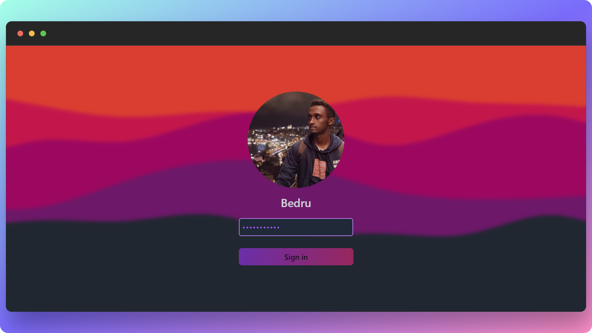

# My Portfolio



## 💻 Live

- Live Site URL: [Here](https://bedru.netlify.app/)

## Motivation

I wanted to create a portfolio that was unique and different from the typical portfolio website. I also wanted to use this project as an opportunity to learn TailwindCSS.

## 🧱 Built With

- React
- TailwindCSS
- Typescript
- SCSS

```TypeScript
if (youLikedThisProject) {
  starThisRepository();
}
```

## 👏 Acknowledgements

🔥 [Fireship](https://www.youtube.com/@Fireship)

- I took inspiration from one of Fireship's videos on SVG animations. I used the same technique to animate the SVGs in my project.
  <br/>

🪄 [Desktop like websites By Simone](https://simone.computer/#/webdesktops)

- I took inspiration from Simone's desktop like websites compilation to create the desktop like website.
